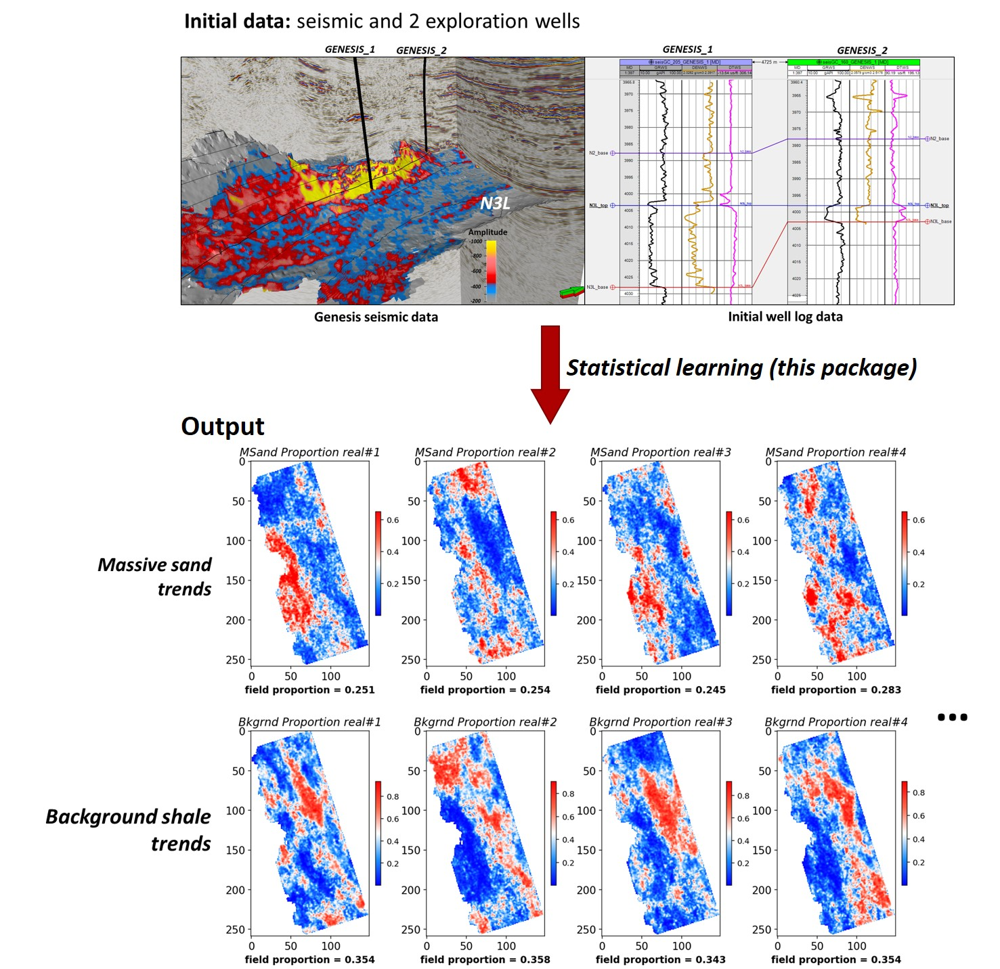

# MH-Dir
 Open-source Python implementation of Metropolis-Hastings (MH) to estimate Dirichlet distributed lithology proportions from seismic. 
 
* To run this repo, please follow the example case in Jupyter Notebook [MH-Dir_Example_v2021704.ipynb](https://github.com/sdyinzhen/MH-Dir/blob/main/MH-Dir_v2021704.ipynb)
 
* The detailed explaination of the method is currently under peer review. We will provide the reference paper here once it is publicly available. 
 
**Figure: illustration of the MH-Dir** 

# Licensing
This repository is released under the MIT License.
